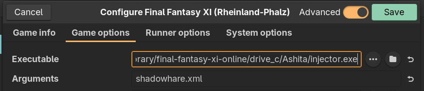

    
    <h1 align="center">Rheinland-Pfalz</h1>

A Final Fantasy XI private server

-   Old-school world
    - Level 75 cap, content through WotG
    - Era-ish exp rate (half modern retail) and fame rate
    - pre-2005 exp table (much more exp required for levels 51-75)
    - Homepoint warping disabled, no Survival Guides/FoV/GoV
    - Original level caps in place for BCNM Missions & CoP

-   Modern elements & enhancements
    - Trusts are enabled, acquired directly as spells from missions/quests
        - Several implemented, more planned
    - Most other aspects are modern (loot tables, drop rates, movement speed, etc.)
    - Skills for Weapons & Magic always capped (skillup system for crafting only)

The point of the server is not to strictly recreate era difficulty; think of Rheinland-Pfalz as era if era could be soloed. 

## Server Rules

-  No dual-boxing allowed
-  Do not use Ashita/Windower plugins/add-ons that are blatant hacks, such as teleportation, no-clipping, speed changes etc. Minimap is fine (and recommended).
-  Generally follow the retail ToS

## How To Play

-	Install the client with [Lutris](https://lutris.net/games/final-fantasy-xi-online/) on Linux. Windows users can download it [here](http://www.playonline.com/ff11us/download/media/install_win.html).
    - Your client must be up to date; you must therefore maintain an active service account to play on Rheinland-Pfalz. Only the retail client will work.

-	Connect to the server address <b>shadowhare.org</b> using [Ashita](https://ashitaxi.com/). If you need help connecting to a private server using Ashita, use [this guide](https://nocturnalsouls.net/__arch_i_ve_d/getting-setup/setup-ashita/).
    -  You will need to edit Ashita's configuration to point to the LSB version of xiloader instead of the default bootloader; you can get it from the LSB xiloader [Releases page](https://github.com/LandSandBoat/xiloader/releases).
    -  If you are playing with Lutris on Linux, you will need to configure the game options to point to the "injector.exe" executable, and add the name of your Ashita config xml file to "Arguments": 
    

         

## Very Highly Recommended Mods
-	[XI View 2.0](https://github.com/KenshiDRK/XiView)
-	[AshenbubsHD Texture Pack](https://www.nexusmods.com/finalfantasy11/mods/1)
-	[Remapster](https://github.com/AkadenTK/remapster_maps)

## Very Highly Recommended Addons/Plugins
- [Minimap](https://docsv3.ashitaxi.com/plugins/minimap/)
- [TParty](https://docsv3.ashitaxi.com/addons/tparty/)
- [Distance](https://docsv3.ashitaxi.com/addons/distance/)
- [DrawDistance](https://docsv3.ashitaxi.com/addons/drawdistance/)
- [FPS](https://docsv3.ashitaxi.com/addons/fps/)
- [MountMuzzle](https://github.com/Sjshovan/Ashita-MountMuzzle)
- [timestamp](https://docsv3.ashitaxi.com/addons/timestamp/)

Join the [FFXiPrivateServers](https://discord.gg/THnWnC9fjr) discord server for information on private servers, LandSandBoat development, client setup for Windows & Linux etc.
